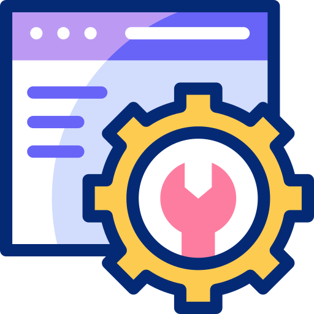

<!-- BANNER -->

---

<h1 align="center">Hey, Nicole here! 😉✨</h1>

  IT Technician · Vibe Coder · Web Development Enthusiast

  Building modern web applications, APIs, and full-stack projects.

---

<h2 align="center">👩‍💻 About Me</h2>

<table align="center">
  <tr>
    <td align="center" width="35%">
      
    </td>
    <td width="65%">
      

        I'm an IT Technician passionate about web development and building things
        that turn ideas into real applications.
      

      

        Currently, I'm focused on full-stack development, working mainly with
        Next.js, TypeScript, Node.js, Prisma, and APIs.
      

      

        I'm always learning, experimenting with new technologies, and improving
        my skills through personal and real-world projects.
      

    </td>
  </tr>
</table>

---

---

<h2 align="center">🚀 Main Stack</h2>

<h3 align="center">🎨 Frontend</h3>

  
  
  
  
  
  

<h3 align="center">⚙️ Backend</h3>

  
  
  
  
  

---

<h3>🧰 Tools & Other Technologies</h3>

 

  
  
  
  
  

---
---

  

